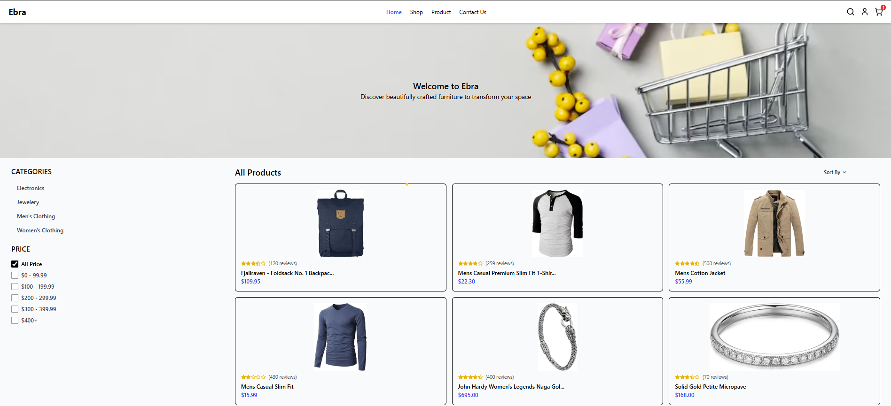
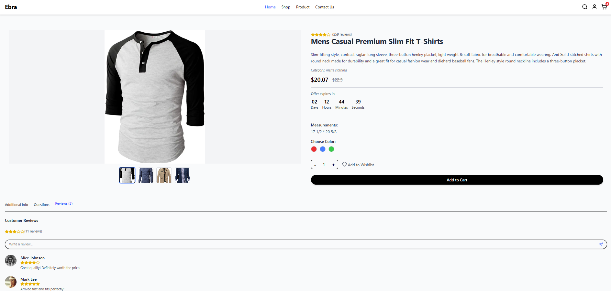
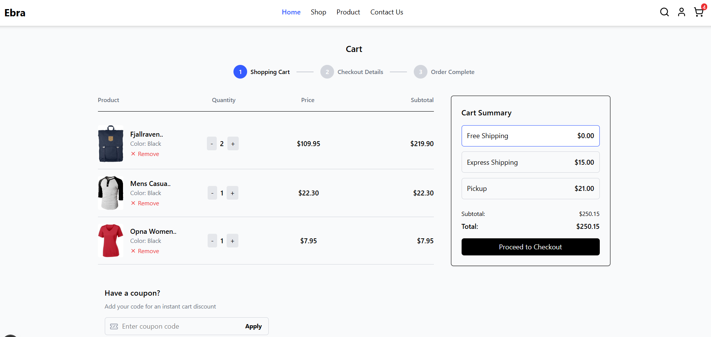

# Ebra E-commerce Store








This app demonstrates modern web development practices using **Next.js (App Router)**, **TypeScript**, **Tailwind CSS**, and **Zustand** for cart state management.

## Features

### Product List Page (`/`)
- Fetches products from the **[Fake Store API](https://fakestoreapi.com/docs)**.
- Displays product image, title, rating and price.
- Clicking a product navigates to the details page.

### Product Details Page (`/product/[id]`)
- Shows full details: image, title, description, category, price, rating and review.
- Includes an **Add to Cart** button.

### Cart Page (`/cart`)
- Lists all products added to the cart.
- Shows total cart price.
- Supports removing items from the cart.

## Tech Stack

- **Next.js (App Router)**
- **TypeScript**
- **Tailwind CSS**
- **Zustand** for cart state management
- **API fetching** using `fetch`
- **Lazy loading** images
- **Error and loading state handling**
- **Accessibility best practices**

## Installation

```bash
npm install

npm start

```
